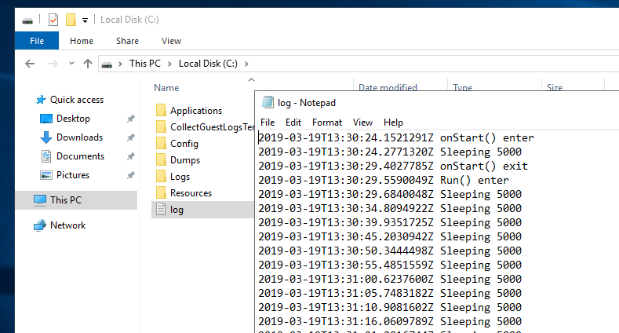

# Azure Cloud Service Role Instance Logging to Azure Table Storage

Main functionality is in [WebRole1/TableLog.cs](WebRole1/TableLog.cs)

## Write to Table Storage

Get started with Azure Table storage and the Azure Cosmos DB Table API using .NET: https://docs.microsoft.com/en-us/azure/cosmos-db/table-storage-how-to-use-dotnet

Need to install packages:

- Microsoft.Azure.Storage.Common, **with version less than or equal to 9.0.0.1 (<= 9.0.0.1)**.
- Microsoft.Azure.CosmosDB.Table

## Cloud Service Setup

**\<role name>.dll.config must be added to project to avoid assembly referencing issue.** https://blogs.msdn.microsoft.com/cie/2015/09/06/cloud-services-roles-recycling-with-the-error-system-io-fileloadexception-could-not-load-file-or-assembly/

> "However, in Azure Cloud Services, the assembly bindings from web.config and app.config does not have effect, due to the fact that WaIISHost (Web Role) and WaWorkerHost (Worker Role) are not able to read these two configuration files, instead, they read the <role name>.dll.config file, and this is the file where the assembly binding configuration need to be. Please, refer to this article for more details. 
>
> The problem is, the \<role name>.dll.config file is not added to Solution by default, and even if it is there, it may happen that it does not have the assembly binding configuration like in web.config or app.config."

Another weird effect is that if \<role name>.dll.config is not added to the project with **Copy to Output Directory** set to **Copy Always**, it is still generated as a duplicate of web.config in the role's bin folder, but never packaged to cspkg. Don't do why. https://stackoverflow.com/questions/25553010/why-doesnt-mywebsite-dll-config-get-included-in-my-cspkg#comment55405844_25563008

Make sure the role has **elevated** permission in order to write to C drive.

```xml
<?xml version="1.0" encoding="utf-8"?>
<ServiceDefinition name="cs_log" xmlns="http://schemas.microsoft.com/ServiceHosting/2008/10/ServiceDefinition" schemaVersion="2015-04.2.6">
  <WebRole name="WebRole1" vmsize="Medium">
    <Runtime executionContext="elevated" />
    ...
  </WebRole>
</ServiceDefinition>
```

## Result



